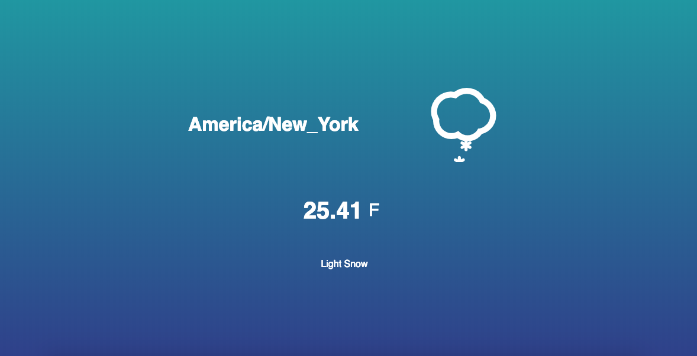

# The-Weather-App

This is a weather application implemented using HTML, CSS and JavaScript.
It uses browser capabilities to access user location and generates a weather report.

This app uses the DarkSky API and Skycons to generate following output:

</img>

References:

* [1] DarkSky API (https://darksky.net/dev/docs)
* [2] Skycons (https://darkskyapp.github.io/skycons/)
